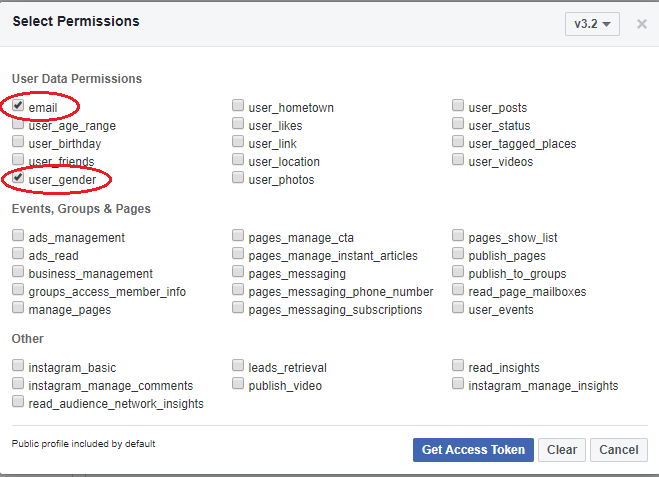

# facebookAPI Exercise 1 – Getting Started

> Complete ALL the exercises in this section. Ask thomas.devine@lyit.ie for help or post an *Issue* on your GitHub repository.

## Clone the Remote Repository

1.	Accept the GitHub Classroom invitation to this exercise at the module Blackboard page

1.	Copy the clone URL from your new repository ``facebookAPI-<YOURACCOUNT>``

1.	Type these commands into your *Git Bash* client:

	```
	$ cd /<DRIVE>/xampp/htdocs   
	$ git clone <URL> facebookAPI
	$ cd facebookAPI
	$ ls
	$ git status
	```

Check your ``htdocs`` folder.  You should have a new folder called ``facebookAPI`` with some files in it.

## Part 1 - Hello facebook Graph API

Let's use some Javascript code to access the facebook Graph API.  
The program below has the code needed to access a facebook App and display some user (you) profile information.

1.  Login to facebook and goto the [Facebook Graph API Explorer](https://developers.facebook.com/tools/explorer/)

1.  Get/copy the `App Id`` for a facebook app you have created.

1.	Using an editor open ``HelloFacebook.html``.  

    Update the facebook `appId` field in the initialisation code below to use your `appId`

    ```javascript
    FB.init({
        appId      : '2003030101033893830383',
        cookie     : true,
        xfbml      : true,
        version    : 'v3.2'
    });         
    ```

1.  Using your browser open the file [HelloFacebook.html](http://localhost/facebookAPI/HelloFacebook.html).  

    You should see some _status_ information and _response_ data retrieved from facebook.

    If you're not logged in use the login button to login to facebook.


## Part 2 - Examine `HelloFacebook.html`

This code has been given to you as a completed solution.  You may recognise some of it from when you initially created your first facebook App @ [https://developers.facebook.com/](https://developers.facebook.com/)

**You need to examine this code and try to understand what it's doing.**

Pay particular attention to the code at:
- line 11 - Provide the correct `appId` value here
- lines 86-89 - Facebook login button
- lines 48-54 - Checks user is logged into facebook and calls `testAPI()` function
- lines 67-76 - Requests data from the Graph API

## Part 3 - Getting More User Profile Information

To get more information about a user using your facebook App is easy.

1.  First, use the Graph API Explorer to request from the user the information your app wants.
    For example, below we want to request the user to share his/her ``email`` and ``gender``.

    

    Do this now with your App.

1.  Next, modify the Login button's ``scope`` attributed in ``HelloFacebook.html`` to request access to these details:

    ```html
    <fb:login-button 
        scope="public_profile,email,gender"  
        data-auto-logout-link="true" 
        onlogin="checkLoginState();"> 
    </fb:login-button>
    ```

    Notice how the ``scope`` variable must include the details your app wants.  The user will be prompted about this when they login and are given an opportunity to accept or decline.

1.  Finally, modify the API call in ``testAPI()`` to request those details too:

    ```javascript
    FB.api('/me?fields=name,email,gender', function(response){
        ...
        ...
    })

    ```

1.  Open [HelloFacebook.html](http://localhost/facebookAPI/HelloFacebook.html) again.  
    
    You should see the _response_ data has the new user properties.

1.  Try getting access to a few more user properties.

